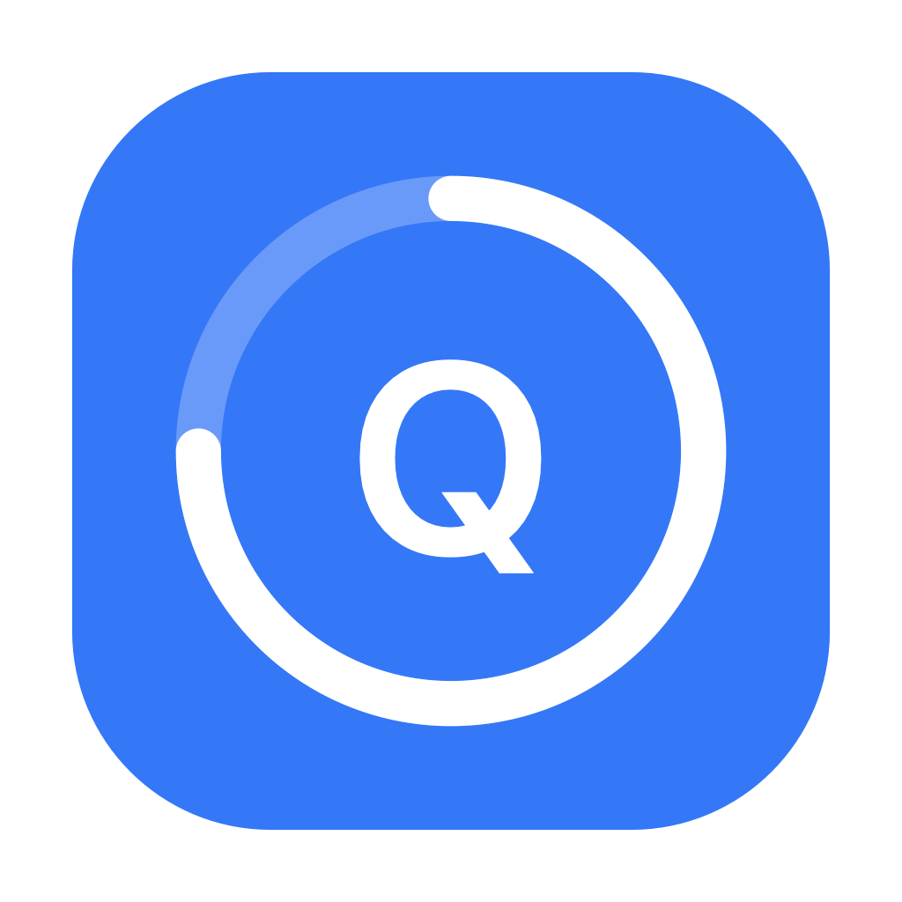

# Slow Quit Apps

<p align="center">
  
</p>

<p align="center">
  <strong>⌘Q の誤操作によるアプリ終了を防止するツール</strong>
</p>

<p align="center">
  <a href="#機能">機能</a> •
  <a href="#インストール">インストール</a> •
  <a href="#使い方">使い方</a> •
  <a href="#設定">設定</a> •
  <a href="#ビルド">ビルド</a> •
  <a href="#ライセンス">ライセンス</a>
</p>

<p align="center">
  <a href="README.md">English</a> |
  <a href="README.zh-CN.md">简体中文</a> |
  <a href="README.ru.md">Русский</a>
</p>

---

## 機能

- 🛡️ **誤終了を防止** - ⌘Q の長押しでアプリを終了
- ⏱️ **時間調整可能** - 0.3秒〜3.0秒で長押し時間を調整
- 📋 **アプリホワイトリスト** - 特定のアプリは即座に終了可能
- 🌐 **多言語対応** - 英語、中国語、日本語、ロシア語
- 🎨 **ネイティブ macOS デザイン** - システム UI とシームレスに統合
- 💾 **設定の永続化** - JSON ファイルに設定を保存

## 必要条件

- macOS 14.0 (Sonoma) 以降
- アクセシビリティ権限が必要

## インストール

### DMG からインストール（推奨）

1. [Releases](../../releases) から最新版をダウンロード
2. DMG ファイルを開く
3. `SlowQuitApps.app` を `アプリケーション` フォルダにドラッグ
4. アプリを開いてアクセシビリティ権限を付与

### ソースからビルド

```bash
git clone https://github.com/030201xz/slow-quit-apps.git
cd slow-quit-apps
./build.sh
```

## 使い方

### 初回セットアップ

1. **アクセシビリティ権限を付与**
   - アプリを開く → システム設定が自動的に開きます
   - **プライバシーとセキュリティ → アクセシビリティ** に移動
   - **SlowQuitApps** をオンに切り替え
   - 設定ウィンドウで **アプリを再起動** をクリック

2. **設定を調整**
   - メニューバーアイコンを右クリック → **設定**
   - 必要に応じて長押し時間を調整
   - 必要に応じてホワイトリストにアプリを追加

### 動作の仕組み

| 操作 | 結果 |
|------|------|
| ⌘Q を短く押す | 何も起こらない（終了キャンセル） |
| ⌘Q を設定時間長押し | アプリが終了 |
| ⌘Q を途中で離す | 終了キャンセル、進行リセット |
| ホワイトリストのアプリで ⌘Q | 即座に終了 |

## 設定

### 設定ファイルの場所

設定は以下に保存されます：
```
~/Library/Application Support/SlowQuitApps/config.json
```

### 利用可能なオプション

| 設定 | 説明 | デフォルト |
|------|------|---------|
| `isEnabled` | 機能の有効/無効 | `true` |
| `holdDuration` | ⌘Q の長押し時間（秒） | `1.0` |
| `launchAtLogin` | ログイン時に起動 | `false` |
| `showProgressAnimation` | 進行リングを表示 | `true` |
| `language` | UI 言語 | `en` |
| `excludedApps` | ホワイトリストアプリ | システムデフォルト |

### 対応言語

| コード | 言語 |
|--------|------|
| `en` | English |
| `zh-CN` | 简体中文 |
| `ja` | 日本語 |
| `ru` | Русский |

## ビルド

### 前提条件

- Xcode 16.0+ または Swift 6.0+
- macOS 14.0+

### ビルドコマンド

```bash
# 開発ビルド
swift build

# リリースビルド（DMG 付き）
./build.sh

# アプリアイコン生成
swift scripts/generate-icon.swift
```

## トラブルシューティング

### 再ビルド後にアクセシビリティ権限がリセットされる

これは ad-hoc 署名が原因です。ビルドスクリプトには自己署名証明書機構が含まれています：

```bash
./build.sh
```

初回実行時に永続的な署名証明書が作成されます。

### アプリが ⌘Q をインターセプトしない

1. アクセシビリティ権限が付与されているか確認
2. 設定で **アプリを再起動** をクリック
3. 対象アプリがホワイトリストにないことを確認

## 貢献

貢献を歓迎します！issues や pull requests をお気軽にお送りください。

## ライセンス

MIT ライセンス - 詳細は [LICENSE](LICENSE) を参照

---

<p align="center">
  macOS のために ❤️ を込めて作成
</p>
